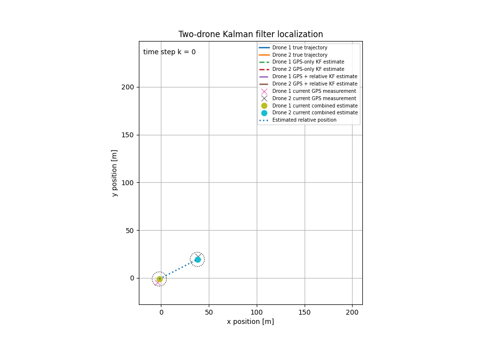

# Cooperative Drone Localization Using a Kalman Filter

This project demonstrates cooperative localization of two drones using a Kalman filter.

Two approaches are compared:

- localization using noisy GPS measurements only;
- localization using GPS together with an additional relative-position measurement between the drones.

The simulation shows that combining absolute and relative measurements significantly improves estimation of the distance and position relationship between the drones.



## Main results

For the default reproducible simulation:

| Method | Absolute-position RMSE | Relative-position RMSE |
|---|---:|---:|
| GPS only | 2.890 m | 4.912 m |
| GPS + relative measurement | 1.922 m | 0.372 m |

The project demonstrates:

- Python-based numerical simulation;
- implementation of a Kalman filter;
- sensor fusion;
- uncertainty modelling;
- evaluation and visualization of estimation accuracy.

## Run the project

Install the required packages:

```bash
pip install -r requirements.txt
```

Run the current implementation:

```bash
python code/main.py
```

Generated figures and the animation are saved in the `figures/` directory.

## Project report

A detailed mathematical description and discussion of the results are available in the accompanying report:

[View the project report](MN_Project_KF.pdf)

## Academic context

Semester project completed as part of the Computational and Applied Mathematics programme at VŠB – Technical University of Ostrava.

